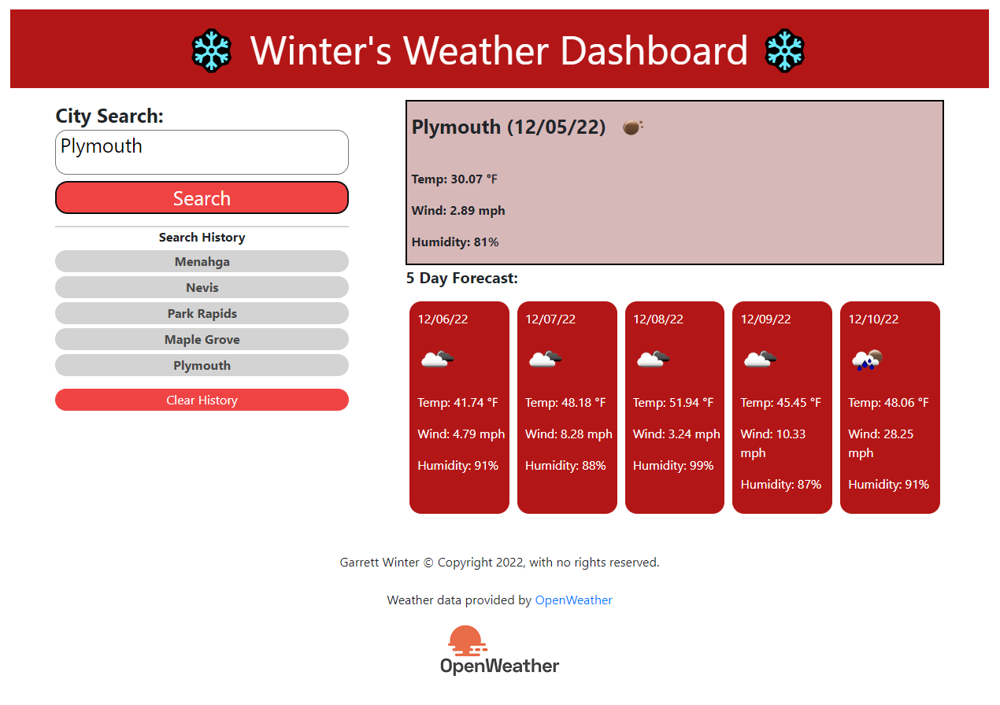

# Winter's Weather Dashboard

## Description

Provide a short description explaining the what, why, and how of your project. Use the following questions as a guide:

- What was your motivation?
    - To make API calls and then process the data from those calls to display information on the screen.
    - To continue to push and improve my skills as a developer.
- What did you learn?
    - How to make API calls.
    - How to source many different parameters from a response API.
    - How to dynamically remove elements.
    - Improve my ability to read API documentation.

## Table of Contents

- [Usage](#usage)
- [Credits](#credits)
- [License](#license)
- [Features](#features)
- [futureFeatures](#futureFeatures)

## Usage

- This is a weather dashboard that allows the user to be able to search for a city. This will make an API call and will return 6 days of weather (the current day and the 5 days after). Searched cities and logged for easy repeat access.

    - This webpage can be viewed by following the below link:
        - https://garrettwinter.github.io/winters-weather-dashboard/
        
    - Below a screenshot of the webpage
        - 

## Credits

While working on this project I had collaborated in real-time with:
  - Garrett Winter (https://github.com/garrettWinter)
  - Salahuddin Imdad (https://github.com/Sal8298)

## License

MIT License

Copyright (c) 2022 Garrett Winter

Permission is hereby granted, free of charge, to any person obtaining a copy
of this software and associated documentation files (the "Software"), to deal
in the Software without restriction, including without limitation the rights
to use, copy, modify, merge, publish, distribute, sublicense, and/or sell
copies of the Software, and to permit persons to whom the Software is
furnished to do so, subject to the following conditions:

The above copyright notice and this permission notice shall be included in all
copies or substantial portions of the Software.

THE SOFTWARE IS PROVIDED "AS IS", WITHOUT WARRANTY OF ANY KIND, EXPRESS OR
IMPLIED, INCLUDING BUT NOT LIMITED TO THE WARRANTIES OF MERCHANTABILITY,
FITNESS FOR A PARTICULAR PURPOSE AND NONINFRINGEMENT. IN NO EVENT SHALL THE
AUTHORS OR COPYRIGHT HOLDERS BE LIABLE FOR ANY CLAIM, DAMAGES OR OTHER
LIABILITY, WHETHER IN AN ACTION OF CONTRACT, TORT OR OTHERWISE, ARISING FROM,
OUT OF OR IN CONNECTION WITH THE SOFTWARE OR THE USE OR OTHER DEALINGS IN THE
SOFTWARE.

## Features

Some of the main features for this weather dashboard are:

3rd Party API:
    - This site uses OpenWeather API to gather the weather forecast data.
        - https://openweathermap.org/

Search History:
    - Is saved into local storage, so can be reviewed easily anytime.
    - A clear history button has been added for the ease to clear saved data.
    - Search history buttons are added and removed dynamically.

Current & 5 Day Forecast:
    - 5 Day forecast is being dynamically created
    - Weather icons are being pulled and displayed to
        - Examples are: Sunny, cloudy, raining.

Responsive Design:
    - This site has been built to support down to mobile devices.

## futureFeatures

Below are some things that were considered or through of during the build that there was not time to implement:

  - Modal overlay while page waiting for API content
  - Create buttons to remove a single history
  - Prevent duplication of cities in the search history
  - Hover over for search and search history buttons
  - Switch from alert to modal for blank search field
  - Center Date and Weather icons in 5day forecast when they are switched to columns
  - Improve error handling on city search to include message in console log or on-screen message
          - {
          - "cod": "404",
          - "message": "city not found"
          - }